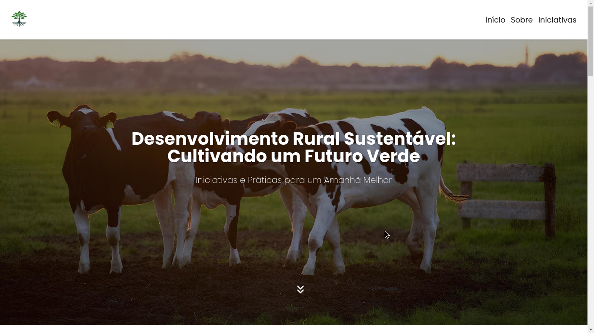

# "Agrinho: Do campo à cidade, colhendo oportunidades"
> A project exploring the interaction between rural and urban areas through technology, promoting sustainable and economic development. This website showcases opportunities created by technological integration between rural and urban environments.

## 📸 Screenshots

## 🛠️ Built With
- HTML5
- CSS3
- JavaScript

## 🛠️ Tools used
- [VLibras](https://www.gov.br/governodigital/pt-br/acessibilidade-e-usuario/vlibras)
- [Pexels](https://www.pexels.com/pt-br/)
- [Bing Image Creator](https://www.bing.com/images/create)

## 🌍 Live Demo
- 🔗 [View Live Demo](https://k4ik.github.io/agrinho-2024)
